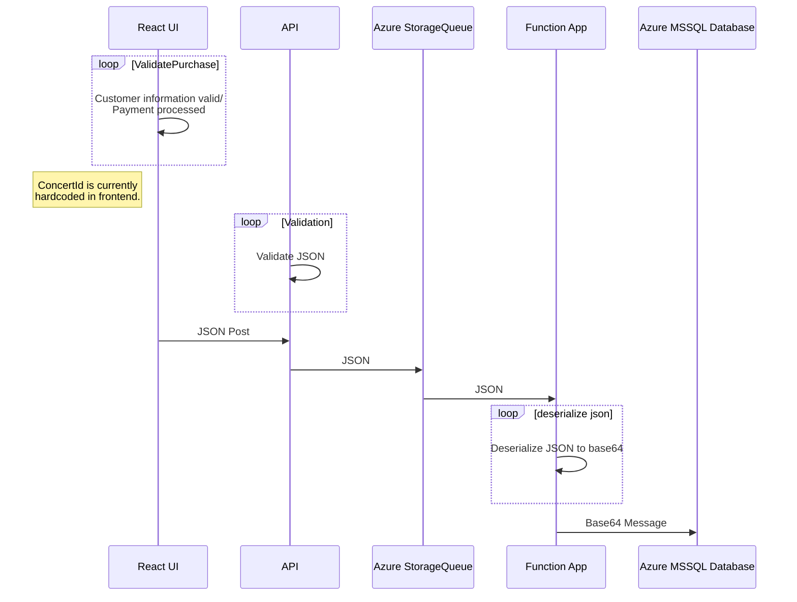

# Azure Workflow

```mermaid

sequenceDiagram
    participant React UI
    loop ValidatePurchase
        React UI->>React UI: Customer information valid/<br/>Payment processed
    end
    Note left of React UI: ConcertId is currently<br/> hardcoded in frontend.
    participant API
    loop Validation
        API->>API: Validate JSON
    end
    React UI->>API: JSON Post
    participant Azure StorageQueue
    API->>Azure StorageQueue: JSON
    Azure StorageQueue->>Function App: JSON
    participant Function App 
    loop deserialize json
        Function App->>Function App: Deserialize JSON to base64
    end
    Function App->>Azure MSSQL Database: Base64 Message
    participant Azure MSSQL Database
    
    


```