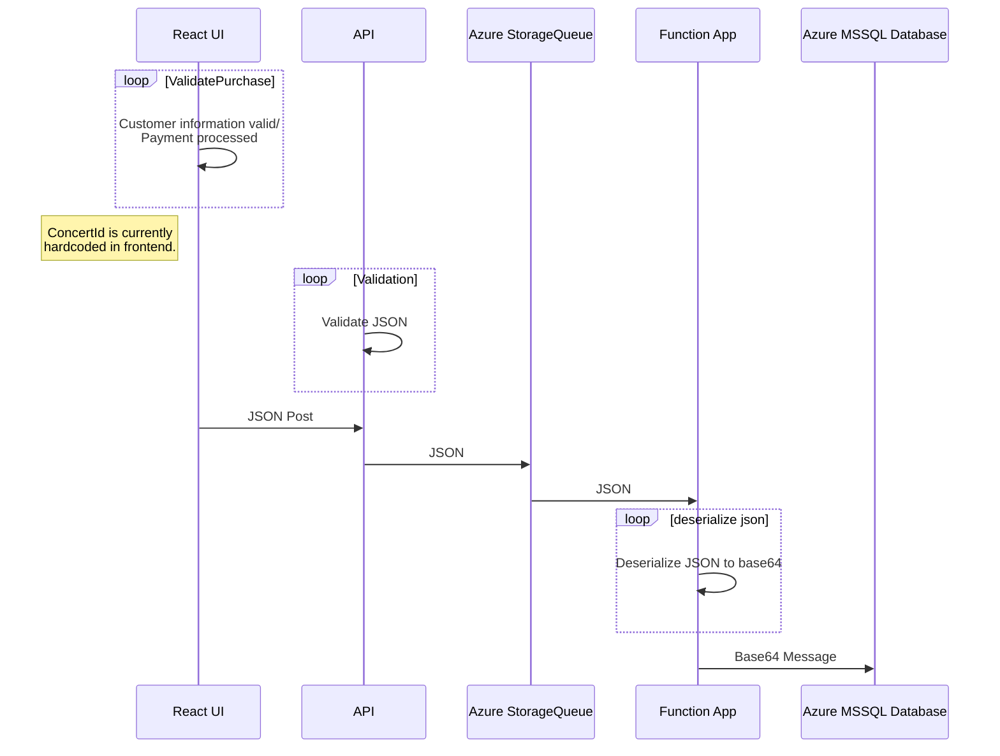

# Overview
TicketHub is a distributed application for purchasing concert tickets. Featuring a Full-Stack Azure workflow, and CI/CD with GitHub actions, allowing users to save and store concert ticket purchases in a SQL database in the cloud. This project began as the final culminating project for Michael Trumbull's INET2007 in Nova Scotia Community College's **IT Programming**. 

The frontend sends JSON data through the pipeline until it ends up in the SQL database. 

## Azure Workflow

